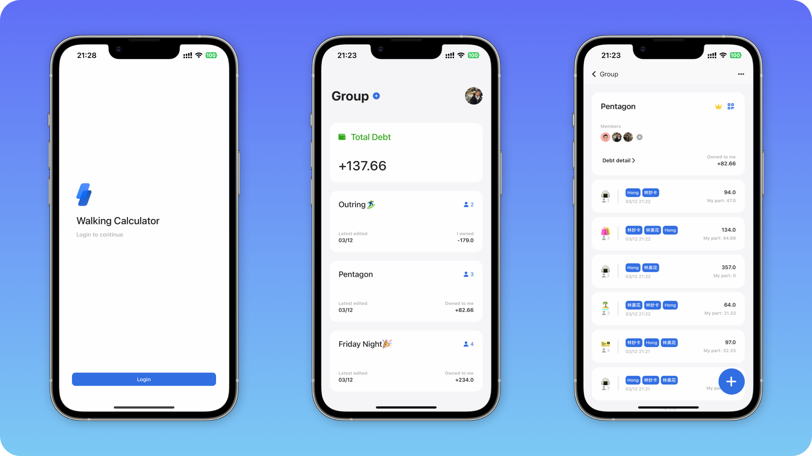
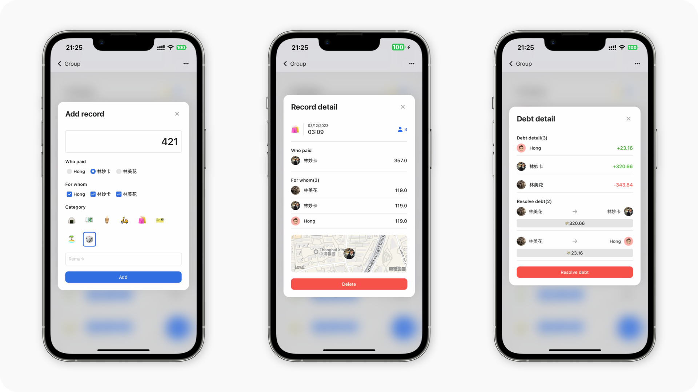

 

  
  <h2 align='center' style='font-weight:600'>Walking Calculator</h2>
  
一个辅助你在朋友之间记账的 App，记录好每笔开销的明细，并帮你计算出最终的债务去向。

  

    <a href="https://apps.apple.com/cn/app/walkingcalculator/id6446189408" target="blank"><strong>👉 App Store</strong></a>
     
  

## 🌈 Features

- ✏️ 随手记录
- 💰 债务和解
- 📍 保存定位
- ☁️ 云端存储
- 👫 好友分享，群组隔离

## 📱 Screenshots

